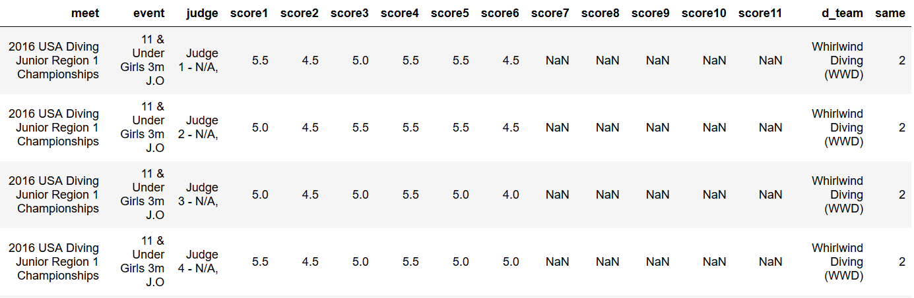
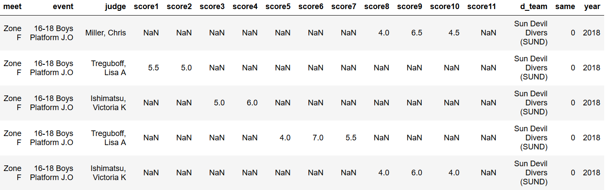
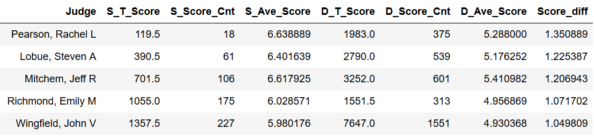
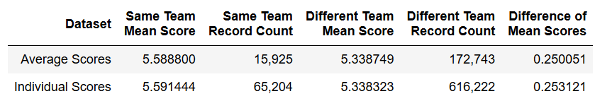
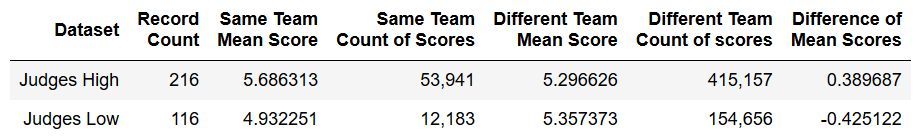

# Part-2

## Analysis of Diving Scores from Divemeets.com
### Background:
Many times, people sit in the stands, on the side lines, or in front of their TV watching a game, competition, or meet and thought that a referee, official, or judge was biased in their calls or scores. Is it true? Are the officiants biased or are we just seeing things from our own biased view point?  
Bias can be very difficult to uncover. Two athletes behaving or performing in the same manner could have different outcomes. Is this really the result of bias or did the officiant legitimately not observe something from one athlete that was seen in the other, maybe because they were looking in a different direction? Improvements in technology has aided the analysis for many of these types of situations and allows some errant calls to be corrected, but still, the question persists.  
The bias we are going to consider here is affiliation bias. In order to determine if there is affiliation bias, you need to know if the officiant and the athlete have a common affiliation, most likely as part of the same team. We would like to know if this bias is evident at the children’s sports level. To determine this, you need to know the events that occurred, the resulting calls or scores, and the affiliation of the athlete and the officiant. This information needs to be readily accessible for a large number of events. Diving provides a very good resource for this type of information. The website divemeets.com has the results from most diving events in the country. It contains diver names, clubs, scores from each judge for the dives, judge’s names, and judge’s affiliations or clubs. The judges are usually coaches, from the teams attending the meets. There are occasional guest judges whose affiliation would be unknown, but these are a minority of the judges. There is also a progression of meets where placing high in one meet allows the diver to advance to the next higher-level meet. 
Phase one of this project involved the collection of the data from the website divemeets.com using beautifulsoup for web scraping and cleaning the data so it is ready for processing. This was done previously so that process is not covered in detail here. The data collected will be used to determine if bias exists in the scores given to the divers. The null hypothesis is that there is no significant difference between the scores judges/coaches give to divers from their same team and the scores they give to divers from other teams. 
### Project – Phase 2 (Phase 1 completed earlier):
The data was analyzed three different ways. The first way was to compute an average score given for each data record and analyze those average scores comparing score from judges/coaches on the same team as the diver they were scoring with the average scores from judges/coaches on different teams from the divers they were scoring. If the team affiliation for a judge or a diver could not be determined, the record was not included in the analysis. 
The second method of analysis was to look at each individual score given, again comparing scores from judges/coaches on the same team as the diver they were scoring with the scores from judges/coaches on different teams from the divers they were scoring.
The third method was to create a record for each judge/coach that gave scores to an affiliated diver and compare the average of the scores they gave to a diver on the same team to the scores they gave to a diver from a different team. 
### The Data:
The data collection and preliminary cleaning was completed in Phase 1 of this project. The data file generated from that process is used as the input file for this phase of the project. For more information on that process, see https://github.com/MSDS-Project/Part1 and https://youtu.be/wPxwS7wc7lI.  
The data collected comes from advancement meets, which are meets where a certain number of the highest placing divers advance to the next meet. These meets are the regional and zone meets. There are 12 regions and 6 zones in the USA resulting in 18 meets a year with data collected for three years, 2016, 2017, and 2018 resulting in 54 meets. There is a maximum of 24 events for which data has been collected. These events are grouped by age, gender, and board-1M, 3M, platform. The data collected includes the meet name, meet date, event name, the judge giving the score, the scores that judge gave up to a maximum of 11, any scores not given contain Nan, the diver name, diver team, and a flag named 'same' indicating the relation of the diver team to the judge team. If the diver team and judge team are not the same, the flag value is 0, if the teams are the same, the flag value is 1, and if either the diver team or the judge team is unknown, the flag value is 2.  

There was still a bit of data cleaning/preparation required that was discovered during the analysis process. The meet name includes the year. There is also a different name for the zone meet for each of the three years. To create consistency in the meet names and to better group the data, the meet name field will be separated into year and meet, and the names will be reduced to simply "Region [X]" and "Zone [Y]". The data file now looks like this: 

The individual scores were totaled and counted, and the average score was calculated. A new dataset was created dropping the individual scores allowing the data to be processed more quickly. The new file contains the following variables: 
<table style="width:100%">
  <tr>
    <th>Variable Name</th>
    <th>Description</th> 
  </tr>
  <tr>
    <td>meet</td>
    <td>name of the meet</td> 
  </tr>
  <tr>
    <td>event</td>
    <td>name of the event</td> 
  </tr>
  <tr>
    <td>judge</td>
    <td>name of the judge</td>
  </tr>
  <tr>
    <td>d_team</td>
    <td>name of diver's team</td>
  </tr>
  <tr>
    <td>same</td>
    <td>flag: 1 = judge/diver on same team {0-2)</td>
  </tr>
  <tr>
    <td>year</td>
    <td>year the meet was held (2016-2018)</td>
   <tr>
     <td>t_score</td>
     <td>total of scores given (0-110)</td>
   <tr>
     <td>score_cnt</td>
     <td>number of scores given in this record (1-11)</td>
   <tr>
     <td>ave_score</td>
     <td>average of the scores given (0-10)</td>
  </tr>    
</table>

The data file for the second method of analysis was created by running an external python program found in create_scores_file. This program should be run to generate the data file before running the Jupyter notebook file. This creates a file containing the variables: 
<table style="width:100%">
  <tr>
    <th>Variable Name</th>
    <th>Description</th> 
  </tr>
  <tr>
    <td>meet</td>
    <td>name of the meet</td> 
  </tr>
  <tr>
    <td>event</td>
    <td>name of the event</td> 
  </tr>
  <tr>
    <td>score</td>
    <td> score given to diver</td>
  <tr>
    <td>same</td>
    <td>flag: 1 = judge/diver on same team {0-2)</td>
  </tr>
  <tr>
    <td>year</td>
    <td>year the meet was held (2016-2018)</td>
  </tr>
</table>

For the third method where individual judges were compared, the data format was: 

Each record contained the following: 
<table style="width:100%">
  <tr>
    <th>Variable Name</th>
    <th>Description</th> 
  </tr>
  <tr>
    <td>Judge</td>
    <td>name of the judge</td>
  </tr>
  <tr>
    <td>S_T_Score</td>
    <td>total of the scores given for divers on the same team</td>
  </tr>
  <tr>
    <td>S_Score_Cnt</td>
    <td>count of the number of the scores given for divers on the same team</td>
  </tr>
  <tr>
    <td>S_Ave_Score</td>
    <td>average of the scores given for divers on the same team (S_T_Score/ S_Score_Cnt)</td>
  </tr>
  <tr>
    <td>D_T_Score</td>
    <td>total of the scores given for divers on a different team</td>
  </tr>
  <tr>
    <td>D_Score_Cnt</td>
    <td>count of the number of the scores given for divers on a different team</td>
  </tr>
  <tr>
    <td>D_Ave_Score</td>
    <td>average of the scores given for divers on a different team (S_T_Score/ S_Score_Cnt)</td>
  </tr>
  <tr>
    <td>Score_Diff</td>
    <td>difference between S_Ave_Score and D_Ave_Score (S_Ave_Score -  D_Ave_Score)</td>
  </tr>
</table>

### The Results:
The following results were obtained when we looked at the average score per record and when the scores were separated out so that each score given was its own record. In both cases, the scores given to divers on the same team as the judge/coach were higher than the scores given to divers on a different team. 

When the data is reorganized so that there is one record for each judge that gave scores to a diver from their own team, and the records grouped by judges who gave higher scores to their own divers and judges who gave lower scores to their own divers, we see that 65% (216 out of 332) of the judges/coaches gave higher scores to their own divers. The judges that scored their own divers lower shows a greater difference in scores than with the judges that scored higher. The 65% of the judges scoring higher are responsible for 73.76% of the total scores given ( (415,157+53,941)/(415,157+53,941+12,183+154,656) ) and 81.58% of the scores given to divers on the same team ( 53,941/(53,941+12,183) ). 

A statistically significant difference was found between the scores given to divers from the same team as the judge/coach and the score given to a diver from a different team as the judge/coach for all three evaluation methods. 

### Additional Study Possibilities:
This study was designed to answer the question of whether bias existed. Additional analysis could answer questions such as the effect bias may have had on a diver’s total score, the effect bias may have had on the outcome of a meet, and if an individual judge is biased. 
To determine the effect bias may have on the outcome of a meet, each individual dive performed by each diver in each event for each meet needs to be considered. Look at the scores given for that dive, comparing the score from an affiliated judge/coach to the scores given by judges/coaches from other teams. Another score list could be created by replacing the affiliated judge/coach score by the average score from the non-affiliated judges/coaches. The total score could be calculated for each set of scores, dropping the high and low score (as is the normal practice) and retaining the middle three scores, summing those three scores and then multiplying that total by the degree of difficulty for the dive (the normal process for calculating the score for a dive). The two resulting scores could then be compared. This would give an accurate picture of the effect of any affiliated judging bias on the scores for a diver and it could be determined if the final results were affected. Similar analysis would be required to answer additional questions.
